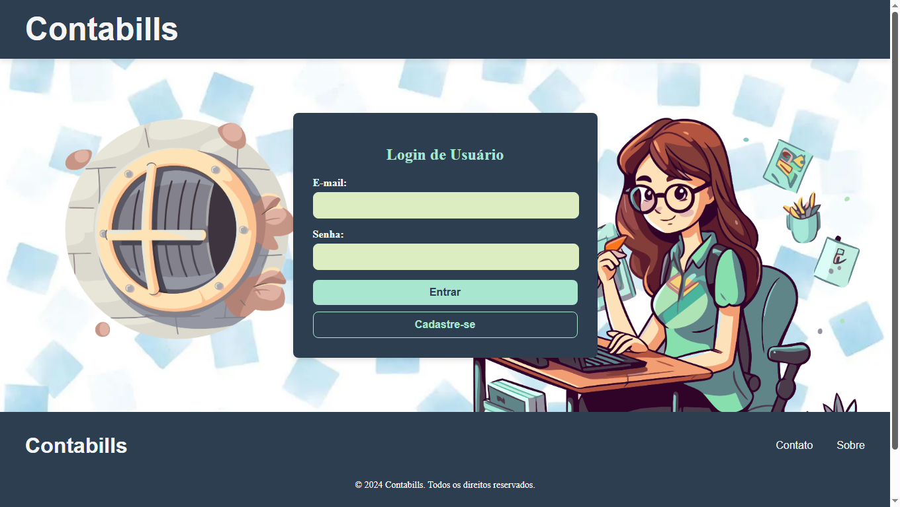

# Contabills - Sistema de Gestão Contábil

Este é o repositório do front-end do **Contabills**, um sistema desenvolvido para auxiliar escritórios de contabilidade na gestão de empresas clientes, com foco na organização e controle de informações legais e contábeis.



## 📌 Visão Geral

O **Contabills** surgiu da necessidade de otimizar o trabalho em escritórios contábeis, especialmente na área legal. Durante minha experiência profissional, percebi que muitos processos eram manuais e ineficientes. Como desenvolvedor e ex-profissional da área, decidi criar uma solução que facilitasse a gestão, reduzindo erros e aumentando a produtividade.

Este projeto foi desenvolvido utilizando **Angular** no front-end, proporcionando uma interface dinâmica e responsiva.

## 🔧 Tecnologias Utilizadas

- **Angular** - Framework principal para o desenvolvimento do front-end
- **TypeScript** - Para um código mais robusto e escalável
- **SCSS (Sass)** - Para estilização otimizada
- **HTML5 & CSS3** - Estruturação e estilização do layout

## 🚀 Como Executar o Projeto

Antes de começar, certifique-se de ter o **Node.js** e o **Angular CLI** instalados em sua máquina.

1. **Clone o repositório:**

```bash
 git clone https://github.com/gersonreismelo/contabills-frontend
```

2. **Acesse o diretório do projeto:**

```bash
 cd contabills-frontend
```

3. **Instale as dependências:**

```bash
 npm install
```

4. **Inicie o servidor de desenvolvimento:**

```bash
 ng serve
```

5. **Acesse o sistema no navegador:**

```
http://localhost:4200
```

## 📌 Funcionalidades Principais

✅ **Gestão de Empresas:** Cadastro e acompanhamento de informações empresariais.

✅ **Controle de Parcelamentos:** Organização de pagamentos e prazos de parcelamentos.

✅ **Administração de Sócios:** Gerenciamento de dados de sócios e responsáveis.

✅ **Área do Usuário:** Cadastro e autenticação segura.

✅ **Interface Intuitiva:** Layout moderno e de fácil navegação.

## 📞 Contato

Caso tenha dúvidas ou queira contribuir com o projeto, entre em contato:

📧 E-mail: [gersonreismelo@gmail.com](mailto:gersonreismelo@gmail.com)

🌐 LinkedIn: [linkedin.com/in/gersonreismelo](https://www.linkedin.com/in/gersonreismelo/)

👨‍💻 GitHub: [github.com/gersonreismelo](https://github.com/gersonreismelo)

---

_Agradeço por conferir o **Contabills**! Espero que este projeto seja útil para otimizar a rotina contábil! 🚀_